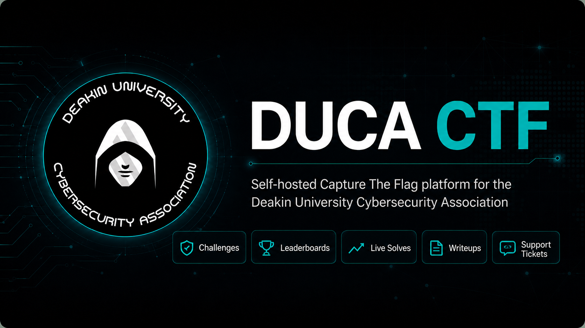

# DUCA CTF

Capture-the-flag platform for the [Deakin University Cybersecurity Association](https://duca.au/) (DUCA).




## Features

- Passwordless email OTP authentication
- Competitions with scheduled challenges and countdown timers
- Multi-flag challenges with static scoring
- Live solves feed (SSE) and leaderboards
- Support chat with admin inbox
- Post-competition writeups (markdown or rich text)
- Admin panel for users, competitions, challenges, writeups, telemetry, and site pages
- All times displayed in AEST/AEDT (Australia/Sydney)

## Stack

[Click here](./docs/architechture.md) to explore the system design / architechture.

| Layer | Technology |
|-------|------------|
| App | Next.js 15 (App Router, JavaScript) |
| Database | PostgreSQL 16 + Prisma 7 |
| Cache / pub-sub | Redis 7 |
| UI | Tailwind CSS + shadcn/ui (dark theme) |
| Production proxy | Caddy (external, via `intranet_1` Docker network) |

## Development guide

### Prerequisites

- Node.js 20+
- Docker (for local PostgreSQL and Redis)
- SMTP credentials for sending login codes

### 1. Clone and install

```bash
git clone https://github.com/hirusha-adi/duca-ctf.git duca-ctf
cd duca-ctf
npm install
```

### 2. Start backing services

```bash
sudo docker compose up -d
```

This starts:

| Service | Host port | Purpose |
|---------|-----------|---------|
| `duca-ctf-postgres` | 5432 | PostgreSQL (`duca_ctf` database) |
| `duca-ctf-redis` | 6379 | Rate limits + SSE pub/sub |

### 3. Configure environment

```bash
cp .env.example .env.local
```

Edit `.env.local`. `DATABASE_URL` is read from `prisma.config.mjs`, not `schema.prisma`. Without `REDIS_URL`, the app falls back to in-memory stores (fine for single-process local dev).

### 4. Migrate and seed

```bash
npm run db:migrate
npm run db:seed
```

### 5. Run the dev server

```bash
npm run dev
```

Open [http://localhost:3000](http://localhost:3000).

### 6. Promote an admin

After a user registers and logs in:

```bash
npm run make-admin -- user@example.com
```

### Dev scripts

| Script | Description |
|--------|-------------|
| `npm run dev` | Next.js dev server |
| `npm run build` | Production build |
| `npm run start` | Start production build locally |
| `sudo docker compose up -d` | Start Postgres + Redis |
| `sudo docker compose down` | Stop Postgres + Redis |
| `npm run db:migrate` | Run Prisma migrations (dev) |
| `npm run db:migrate:deploy` | Apply migrations (production) |
| `npm run db:seed` | Seed default categories and site pages |
| `npm run db:studio` | Open Prisma Studio |
| `npm run make-admin` | Promote a user to admin by email |
| `npm run db:backup` | Create a production DB backup (prod compose) |
| `npm run db:restore` | Restore DB from latest backup (prod compose) |

## Deployment guide

Production runs as four Docker containers behind Caddy. PostgreSQL and Redis communicate with the web app on a private bridge network (`hirusha-duca-ctf-net`). Only the web container also joins the external `intranet_1` network so Caddy can reverse-proxy to it. All persistent data is stored in bind mounts under `./data/` and `./backups/`.

```
                    ┌─────────────┐
  Internet ────────►│    Caddy    │  (intranet_1)
                    └──────┬──────┘
                           │ :3000
                    ┌──────▼──────────────────┐
                    │  hirusha-duca-ctf-web   │
                    └──┬──────────────────┬───┘
           hirusha-duca-ctf-net           │
    ┌──────────┼──────────┬───────────────┘
    │          │          │
┌───▼────┐ ┌───▼─────┐ ┌──▼─────┐
│postgres│ │  redis  │ │ backup │  (daily cron)
└───┬────┘ └────┬────┘ └───┬────┘
    │           │          │
 ./data/    ./data/    ./backups/
```

Before first deploy, create the data directories (git keeps the paths via `.gitkeep` files):

```bash
mkdir -p data/postgres data/redis data/uploads backups
```

### Prerequisites

- Docker and Docker Compose v2 on the host
- External Docker network `intranet_1` (shared with Caddy)
- SMTP credentials
- DNS + TLS handled by Caddy

Create the shared network once if it does not exist:

```bash
sudo docker network create intranet_1
```

### 1. Configure production environment

On the server, clone the repo and create `.env` from the production template:

```bash
cp .env.prod.example .env
```

Generate strong secrets with OpenSSL (run on the server, paste the output into `.env`):

```bash
# PostgreSQL password (32 hex chars)
openssl rand -hex 16

# Session secret — iron-session requires at least 32 characters (48 chars base64)
openssl rand -base64 36
```

Copy the values into `.env`:

```env
POSTGRES_PASSWORD=<output from first command>
SESSION_SECRET=<output from second command>
```

And also fill all of the other values.

| Variable | Notes |
|----------|-------|
| `POSTGRES_PASSWORD` | Used by Postgres and the web app's `DATABASE_URL` |
| `SESSION_SECRET` | Signs/encrypts login cookies; must be at least 32 characters |
| `SMTP_*` | Your mail provider credentials (not generated) |

`docker-compose.prod.yml` sets `DATABASE_URL`, `REDIS_URL`, `NODE_ENV`, and `UPLOAD_DIR` automatically from `POSTGRES_*` values.

### 2. Build and start

```bash
sudo docker compose -f docker-compose.prod.yml up -d --build
```

On startup the web container runs `prisma migrate deploy` then starts Next.js.

### 3. Seed (first deploy only)

```bash
sudo docker compose -f docker-compose.prod.yml exec hirusha-duca-ctf-web \
  node prisma/seed.js
```

### 4. Promote an admin

```bash
sudo docker compose -f docker-compose.prod.yml exec hirusha-duca-ctf-web \
  node scripts/make-admin.js user@example.com
```

### 5. Configure Caddy

Caddy must be attached to `intranet_1` so it can reach the web container by service name:

```caddyfile
ctf.example.com {
    reverse_proxy hirusha-duca-ctf-web:3000 {
        # Forward the visitor's public IP to the app for telemetry and solve logging
        header_up X-Forwarded-For {remote_ip}
        header_up X-Real-IP {remote_ip}
        header_up X-Forwarded-Proto {scheme}
        header_up Host {host}
    }
}
```

#### Client IP logging (telemetry / solves)

The app reads the visitor IP from proxy headers in this order:

1. `X-Forwarded-For` (first address in the list)
2. `X-Real-IP`
3. `CF-Connecting-IP` (if you terminate TLS at Cloudflare in front of Caddy)

Caddy is the only service that should reach `hirusha-duca-ctf-web` on `intranet_1`, so these headers are trusted. The web container is not published to the host, which prevents clients from bypassing Caddy and spoofing IPs.

**Verify it works** — after deploy, log in or submit a flag, then check Admin → Telemetry. The IP column should show your public address, not a Docker internal IP like `172.x.x.x`.

```bash
# Quick header check from inside the intranet_1 network (optional)
sudo docker run --rm --network intranet_1 curlimages/curl:latest \
  -sI -H "Host: ctf.example.com" http://hirusha-duca-ctf-web:3000/ | grep -i forwarded
```

If IPs still show as `127.0.0.1`:

- Confirm Caddy and `hirusha-duca-ctf-web` are both on `intranet_1`
- Confirm the Caddyfile uses the container name `hirusha-duca-ctf-web:3000`, not `localhost:3000`
- Reload Caddy after editing the Caddyfile: `sudo docker compose restart caddy`

<details>
<summary>Example Caddy Docker Compose snippet</summary>

```yaml
services:
  caddy:
    image: caddy:2-alpine
    ports:
      - "80:80"
      - "443:443"
    volumes:
      - ./Caddyfile:/etc/caddy/Caddyfile
      - caddy_data:/data
      - caddy_config:/config
    networks:
      - intranet_1

networks:
  intranet_1:
    external: true
```

</details>

The web container is **not** published to the host — Caddy is the only public entry point.

### Production services

| Container | Network(s) | Notes |
|-----------|------------|-------|
| `hirusha-duca-ctf-web` | `hirusha-duca-ctf-net`, `intranet_1` | Next.js, port 3000 (expose only) |
| `hirusha-duca-ctf-postgres` | `hirusha-duca-ctf-net` | No host port binding |
| `hirusha-duca-ctf-redis` | `hirusha-duca-ctf-net` | No host port binding |
| `hirusha-duca-ctf-backup` | `hirusha-duca-ctf-net` | Daily `pg_dump` at 03:00, keeps 3 rotating copies |

### Data directories (bind mounts)

| Host path | Container path | Purpose |
|-----------|----------------|---------|
| `./data/postgres` | `/var/lib/postgresql/data` | PostgreSQL data |
| `./data/redis` | `/data` | Redis AOF persistence |
| `./data/uploads` | `/app/data/uploads` | User/support/writeup uploads |
| `./backups` | `/backups` | Gzip SQL dumps (`duca_ctf_YYYYMMDD_HHMMSS.sql.gz`) |

### Updates

```bash
git pull
sudo docker compose -f docker-compose.prod.yml up -d --build
```

Migrations run automatically on container start.

### Production operations

**View logs**

```bash
sudo docker compose -f docker-compose.prod.yml logs -f hirusha-duca-ctf-web
```

**Restart a service**

```bash
sudo docker compose -f docker-compose.prod.yml restart hirusha-duca-ctf-web
```

**Shell into web container**

```bash
sudo docker compose -f docker-compose.prod.yml exec hirusha-duca-ctf-web sh
```

### Database backup and restore

Backups are gzip-compressed SQL dumps written to `./backups/`. The stack keeps only the **3 newest** files — older backups are deleted automatically after every backup, including manual runs.

#### Automatic backups

The `hirusha-duca-ctf-backup` container runs a cron job **every day at 03:00** (container local time). It starts with the rest of the stack:

```bash
sudo docker compose -f docker-compose.prod.yml up -d
```

View backup scheduler logs:

```bash
sudo docker compose -f docker-compose.prod.yml logs -f hirusha-duca-ctf-backup
```

#### Manual backup

From the project root on the host:

```bash
npm run db:backup
# or
bash scripts/backup-db.sh
```

This creates a new `backups/duca_ctf_YYYYMMDD_HHMMSS.sql.gz` and prunes older files down to 3.

List current backups:

```bash
ls -lh backups/
```

#### Restore

**Warning:** restore replaces the current database contents.

Restore the **latest** backup (stops the web container during restore, then starts it again):

```bash
npm run db:restore
# or
bash scripts/restore-db.sh
```

Restore a **specific** backup:

```bash
bash scripts/restore-db.sh backups/duca_ctf_20250608_030001.sql.gz
```

Skip the confirmation prompt:

```bash
bash scripts/restore-db.sh -y
```

Keep the web container running (not recommended during restore):

```bash
bash scripts/restore-db.sh -y --no-stop-web backups/duca_ctf_20250608_030001.sql.gz
```

#### Backup configuration

| Variable | Default | Purpose |
|----------|---------|---------|
| `BACKUP_KEEP_COUNT` | `3` | Number of rotating backups to retain |
| `POSTGRES_DB` | `duca_ctf` | Database name used in dump filenames |

Set `BACKUP_KEEP_COUNT` in `.env` if you want a different retention count.

### Production checklist

- [ ] `POSTGRES_PASSWORD` and `SESSION_SECRET` set to strong random values
- [ ] SMTP credentials verified (send a test login code)
- [ ] `intranet_1` network exists and Caddy is attached
- [ ] Caddy `reverse_proxy` points to `hirusha-duca-ctf-web:3000`
- [ ] Database seeded on first deploy
- [ ] At least one admin user promoted
- [ ] `data/` and `backups/` directories exist on the host
- [ ] `hirusha-duca-ctf-backup` container is running
- [ ] At least one manual backup verified (`npm run db:backup`)
