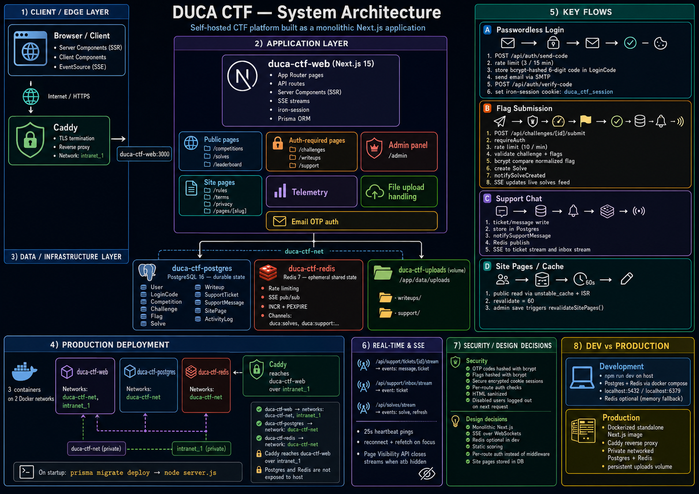

# DUCA CTF — Architecture

This document describes how the DUCA CTF platform is structured, how its major subsystems interact, and how it is deployed in production.




## Overview


DUCA CTF is a self-hosted capture-the-flag platform built for the Deakin University Cybersecurity Association. It is a **monolithic Next.js application** backed by **PostgreSQL** (persistent state) and **Redis** (shared ephemeral state). There is no separate API server or background worker process — API routes, server components, and SSE streams all run inside the same Next.js process.

```
┌─────────────────────────────────────────────────────────────────────┐
│                         Browser / Client                            │
│  Server Components (SSR)  ·  Client Components  ·  EventSource SSE │
└───────────────────────────────┬─────────────────────────────────────┘
                                │ HTTPS (production via Caddy)
┌───────────────────────────────▼─────────────────────────────────────┐
│                    hirusha-duca-ctf-web (Next.js 15)                │
│  App Router pages  ·  API routes  ·  iron-session  ·  Prisma ORM    │
└───────┬─────────────────────────────────────┬─────────────────────┘
        │                                     │
        │ hirusha-duca-ctf-net                │ Redis pub/sub + INCR
        ▼                                     ▼
┌───────────────────┐               ┌───────────────────┐
│ hirusha-duca-ctf- │               │ hirusha-duca-ctf- │
│     postgres      │               │      redis        │
└───────────────────┘               └───────────────────┘
```

---

## Technology stack

| Layer | Choice | Role |
|-------|--------|------|
| Framework | Next.js 15 (App Router, JavaScript) | Pages, API routes, SSR, standalone Docker output |
| ORM | Prisma 7 + `@prisma/adapter-pg` | Schema, migrations, typed queries via `pg` pool |
| Database | PostgreSQL 16 | All durable data |
| Cache / pub-sub | Redis 7 | Rate limits, SSE event bus across instances |
| Auth | iron-session + bcryptjs | Encrypted cookie sessions; OTP codes hashed at rest |
| Email | nodemailer | Passwordless login codes |
| UI | Tailwind CSS 4 + shadcn/ui | Dark-themed component library |
| Rich text | TipTap, react-md-editor | Challenge/writeup/site-page editing |
| Timezone | date-fns-tz (`Australia/Sydney`) | All user-facing times in AEST/AEDT |
| Reverse proxy | Caddy (external) | TLS termination; proxies to web container |

---

## Repository layout

```
src/
  app/                  # Next.js App Router — pages and API routes
    api/                # REST + SSE endpoints
    admin/              # Admin panel (server-rendered)
    challenges/         # Challenge detail (auth required)
    competitions/       # Public competition listings
    support/            # Support chat (auth required)
    solves/             # Live solves feed (public)
    writeups/           # Post-competition writeups (auth required)
    rules|terms|privacy # System site pages (cached)
  components/           # React components (client + server)
  hooks/                # Client hooks (SSE streams, page visibility)
  lib/                  # Server-side business logic
prisma/
  schema.prisma         # Data model
  migrations/           # SQL migrations
  seed.js               # Default categories + site pages
docker-compose.yml      # Dev: Postgres + Redis on localhost
docker-compose.prod.yml # Prod: web + Postgres + Redis
Dockerfile              # Multi-stage Next.js standalone image
```

There is **no Next.js middleware**. Access control is enforced per-page (`requirePageAuth`) and per-API-route (`requireAuth` / `requireAdmin`).

---

## Runtime environments

### Development

- Next.js dev server runs on the host (`npm run dev`).
- Postgres and Redis run via `docker compose up -d` on `localhost:5432` and `localhost:6379`.
- Environment loaded from `.env.local` / `.env`.
- Redis is optional locally; without `REDIS_URL`, in-memory fallbacks are used.

### Production

Three containers on two Docker networks:

| Container | Network(s) | Purpose |
|-----------|------------|---------|
| `hirusha-duca-ctf-web` | `hirusha-duca-ctf-net`, `intranet_1` | Next.js app (port 3000, expose only) |
| `hirusha-duca-ctf-postgres` | `hirusha-duca-ctf-net` | Database (not exposed to host) |
| `hirusha-duca-ctf-redis` | `hirusha-duca-ctf-net` | Pub/sub + rate limits (not exposed to host) |

- **`hirusha-duca-ctf-net`** — private bridge; web talks to Postgres and Redis by container hostname.
- **`intranet_1`** — external shared network; Caddy reaches `hirusha-duca-ctf-web:3000`.

On container start, `docker-entrypoint.sh` runs `prisma migrate deploy`, then `node server.js`. Uploads persist in the `hirusha-duca-ctf-uploads` volume at `/app/data/uploads`.

---

## Data model

PostgreSQL holds all durable state. Key entities:

```
User ──┬── LoginCode (OTP hashes)
       ├── Solve (per flag capture)
       ├── ActivityLog (telemetry)
       ├── SupportTicket
       └── SupportMessage

Competition ── Challenge ──┬── Flag (bcrypt-hashed)
                           ├── Solve
                           ├── Writeup
                           └── (support references)

Category ── Challenge
SitePage (rules, terms, privacy + custom pages)
```

### Scoring rules

- Each challenge has a static `points` value and one or more `Flag` records.
- A user earns full challenge points on their **first correct flag** for that challenge.
- Additional flags on the same challenge award **0 points** but are still recorded as solves.
- Leaderboards aggregate `pointsAwarded > 0` per user within a competition.
- Admins can **unsolve** a user+challenge pair, deleting all flag solves and points for that challenge.

### Competition lifecycle

Competitions have `startAt`, `endAt`, `status` (`DRAFT` / `ACTIVE` / `ENDED`), and a `hidden` flag. Challenges have their own `startAt` and `hidden` flag. Availability is computed at query time in `src/lib/competitions.js` — there is no cron job flipping statuses.

### Flags

Flag values are stored as bcrypt hashes (`flagHash`). Plaintext values exist in the `value` column for admin reference only. Submission normalizes input then compares against all flags on the challenge.

---

## Authentication

Passwordless email OTP flow:

```
1. POST /api/auth/send-code { email }
   → rate-limited (3 per 15 min per email, Redis or memory)
   → creates user if new
   → stores bcrypt-hashed 6-digit code in LoginCode (10 min expiry)
   → sends email via SMTP

2. POST /api/auth/verify-code { email, code }
   → validates code (max 5 attempts per code)
   → sets iron-session cookie (userId)

3. GET /onboarding (if profileComplete = false)
   → POST /api/auth/onboarding { name, studentId }

4. POST /api/auth/logout
   → destroys session cookie
```

### Session cookie

Configured in `src/lib/session.js`:

- **Cookie name:** `duca_ctf_session`
- **TTL:** 7 days (seal + cookie aligned)
- **Flags:** `httpOnly`, `sameSite: lax`, `secure` in production
- **Storage:** encrypted iron-session payload in the cookie (stateless — no server-side session store)

`getCurrentUser()` reads the session, loads the user from Postgres, and destroys the session if the user is disabled.

### Access control

| Area | Requirement |
|------|-------------|
| `/competitions`, `/solves`, `/leaderboard` | Public |
| `/challenges/*`, `/writeups/*`, `/support/*` | Logged in (`requirePageAuth`) |
| `/admin/*`, `/api/admin/*` | Admin role (`requireAdmin`) |
| Competition page challenge links | Shown only when logged in |
| Writeups | Locked until competition ends (admins bypass) |

---

## Database access

`src/lib/db.js` creates a singleton `PrismaClient` via the `@prisma/adapter-pg` driver adapter over a `pg` connection pool. In development, the client is hot-reloaded safely: if Prisma models are missing after a schema change, the client is recreated.

Connection URL comes from `DATABASE_URL` (referenced in `prisma.config.mjs`, not `schema.prisma`).

**Transaction note:** avoid `include` on writes inside `$transaction` — Prisma's pg adapter can issue concurrent queries on the transaction connection, triggering pg deprecation warnings. The support message route creates records without `include`, then fetches relations afterward.

---

## Redis

When `REDIS_URL` is set, Redis provides shared state across multiple web instances. Without it, each subsystem falls back to in-memory stores (fine for single-process dev).

### Rate limiting (`src/lib/rate-limit.js`)

Uses `INCR` + `PEXPIRE` with keys like `rate:otp:{email}` and `rate:submit:{userId}`.

| Endpoint | Limit |
|----------|-------|
| OTP send | 3 per 15 minutes per email |
| Flag submit | 10 per minute per user |

Falls back to an in-memory `Map` if Redis is unavailable.

### SSE pub/sub

Two separate event buses, both using Redis `PUBLISH` / `SUBSCRIBE` (or in-memory `Set` listeners):

| Bus | Channel(s) | Events |
|-----|------------|--------|
| Support (`solves-events.js` pattern) | `duca:support:ticket:{id}`, `duca:support:inbox:{key}` | `message`, `ticket` |
| Solves (`solves-events.js`) | `duca:solves` | `solve`, `refresh` |

Publishers are called after writes (e.g. `notifySupportMessage`, `notifySolveCreated`). Subscribers are SSE stream handlers.

---

## Real-time updates (SSE)

Three SSE endpoints push live data to the browser via `EventSource`:

| Stream | Route | Auth | Events |
|--------|-------|------|--------|
| Support ticket | `/api/support/tickets/[id]/stream` | Yes | `message`, `ticket` |
| Support inbox | `/api/support/inbox/stream` | Yes | `ticket` (sidebar updates) |
| Live solves | `/api/solves/stream` | No | `solve`, `refresh` |

### SSE infrastructure

- `src/lib/support-sse.js` — `createSseResponse()` builds a `ReadableStream` with JSON `data:` frames and 25s heartbeat pings.
- Client hooks in `src/hooks/use-support-stream.js` and `src/hooks/use-solves-stream.js`.
- On reconnect (or tab refocus), hooks call `onReconnect` to refetch full state.
- **Page Visibility API** (`src/hooks/use-page-visible.js`) closes SSE connections when the tab is hidden and reconnects on focus, reducing idle traffic.

### Live solves flow

```
Flag submitted (POST /api/challenges/[id]/submit)
  → Solve created in Postgres
  → notifySolveCreated(solveId)
  → Redis PUBLISH { type: "solve", solve }
  → All /api/solves/stream clients receive event
  → LiveSolveFeed prepends new solve to list

Admin unsolve
  → notifySolvesRefresh()
  → Redis PUBLISH { type: "refresh" }
  → Clients refetch full solve list
```

---

## Support chat

Users create tickets at `/support`. Admins manage all tickets at `/admin/chats`.

```
SupportTicket
  ├── subject, status (OPEN/CLOSED)
  ├── optional competition/challenge reference
  └── SupportMessage[]
        ├── body (text)
        ├── attachments (JSON: url, name, mimeType, size)
        └── optional competition/challenge mention
```

- Message rate limit: 1 per second per user (checked via last message timestamp in Postgres, `support-rate-limit.js`).
- Attachments uploaded to `UPLOAD_DIR/support/` via `/api/support/upload`.
- Ticket/message writes trigger `notifySupportMessage` → SSE to ticket stream + inbox streams.
- Admins see user names in the sidebar; users see their own tickets only.

---

## Site pages

Static content pages (rules, terms, privacy) and custom admin-created pages are stored in the `SitePage` table.

- System pages live at `/rules`, `/terms`, `/privacy`.
- Custom pages live at `/pages/[slug]`.
- Public reads are cached for 60 seconds via `unstable_cache` in `src/lib/site-pages.js` and ISR (`revalidate = 60`) on page routes.
- Admin edits call `revalidateSitePages()` to bust cache tags and paths immediately.

---

## File uploads

Uploads are stored on the filesystem, not in the database.

| Type | API route | Storage path | Served at |
|------|-----------|--------------|-----------|
| Writeup images | `/api/upload` | `{UPLOAD_DIR}/writeups/` | `/uploads/writeups/...` |
| Support attachments | `/api/support/upload` | `{UPLOAD_DIR}/support/` | `/uploads/support/...` |

- `UPLOAD_DIR` defaults to `public/uploads` in dev.
- Production uses `/app/data/uploads` on a Docker volume.
- Filenames are UUID-based. Images are validated by MIME type.

---

## Telemetry

`ActivityLog` records user actions with IP, user agent, action string, and JSON metadata. Logged events include:

- Registration, login code sent
- Challenge views, flag submissions (correct/incorrect)
- Admin actions (save challenge, unsolve, site page edits, etc.)
- Support-related events

Admins browse logs at `/admin/telemetry` with filtering by user and action.

---

## Admin panel

Server-rendered pages under `/admin` with client-side managers for CRUD:

| Section | Path | Capabilities |
|---------|------|-------------|
| Dashboard | `/admin` | User/competition/challenge counts, recent activity |
| Users | `/admin/users` | List, disable, view detail |
| User detail | `/admin/user/[email]` | Solves, activity, unsolve |
| Competitions | `/admin/competitions` | Create, edit, hide, schedule |
| Challenges | `/admin/challenges` | Create, flags, points, hide, submit limits |
| Writeups | `/admin/writeups` | Edit post-competition writeups |
| Submissions | `/admin/submissions` | Flag attempt log, unsolve |
| Site pages | `/admin/pages` | Edit rules/terms/privacy + custom pages |
| Support | `/admin/chats` | All support tickets |
| Telemetry | `/admin/telemetry` | Activity log browser |

Admin promotion is CLI-only: `node scripts/make-admin.js user@example.com`.

---

## Caching strategy

| Data | Mechanism | TTL / invalidation |
|------|-----------|-------------------|
| Site pages (public) | `unstable_cache` + ISR | 60s; busted on admin save |
| Navbar session | Dynamic per request | N/A (reads cookie) |
| Leaderboard / solves initial load | SSR from Postgres | Fresh on page load; solves update via SSE |
| Rate limit counters | Redis INCR | Window-based expiry |

---

## Security measures

- **OTP codes:** bcrypt-hashed, expire in 10 minutes, max 5 verification attempts.
- **Sessions:** iron-session encrypted cookies, 7-day TTL, secure flag in production.
- **Flags:** bcrypt-hashed; never returned to clients.
- **HTML content:** sanitized via `isomorphic-dompurify` on rich-text saves.
- **Rate limits:** OTP, flag submission (Redis-backed).
- **Auth checks:** per-route, not middleware — API routes throw `UNAUTHORIZED`/`FORBIDDEN`; pages redirect to login.
- **Admin unsolve:** requires admin role; logged to telemetry.
- **Disabled users:** session destroyed on next request.

---

## Key request flows

### Flag submission

```
POST /api/challenges/[id]/submit { flag }
  → requireAuth
  → rate limit (10/min)
  → load challenge + flags + competition
  → check availability, submit limit, hidden status
  → bcrypt-compare normalized flag
  → create Solve (0 or full points)
  → notifySolveCreated → SSE
  → log telemetry
  → return { success, message, pointsAwarded }
```

### Login

```
POST /api/auth/send-code
  → rate limit → find/create user → hash OTP → email → log

POST /api/auth/verify-code
  → find valid LoginCode → bcrypt compare
  → mark code used → set session → log
```

---

## Production deployment summary

```
Internet
   │
   ▼
┌─────────┐     intranet_1      ┌─────────────────────┐
│  Caddy  │ ──────────────────► │ hirusha-duca-ctf-web │
└─────────┘                     └──────────┬──────────┘
                                           │ hirusha-duca-ctf-net
                              ┌────────────┴────────────┐
                              ▼                         ▼
                    hirusha-duca-ctf-postgres   hirusha-duca-ctf-redis
```

Caddy config example:

```caddyfile
ctf.example.com {
    reverse_proxy hirusha-duca-ctf-web:3000
}
```

See `README.md` for step-by-step deployment instructions.

---

## Design decisions

| Decision | Rationale |
|----------|-----------|
| Monolithic Next.js | Simple deploy, one container, SSR + API + SSE in one process |
| iron-session (stateless cookies) | No session store to manage; works across restarts |
| Redis optional in dev | Lower barrier for local development |
| SSE over WebSockets | One-way push is sufficient; works through HTTP proxies |
| Static scoring | Predictable points; no dynamic decay complexity |
| Per-route auth (no middleware) | Explicit control; pages and APIs can differ (redirect vs 401) |
| Prisma driver adapter | Required for Prisma 7; uses `pg` pool directly |
| Site page DB storage | Admins can edit legal/info pages without redeploying |
| Caddy on separate network | Web container not exposed to host; TLS handled externally |
